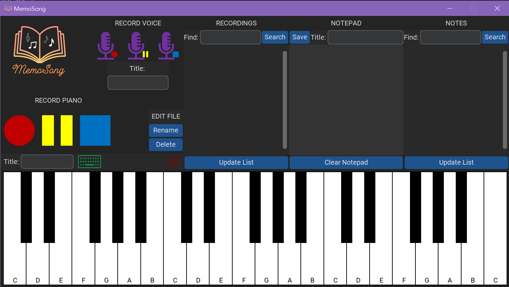
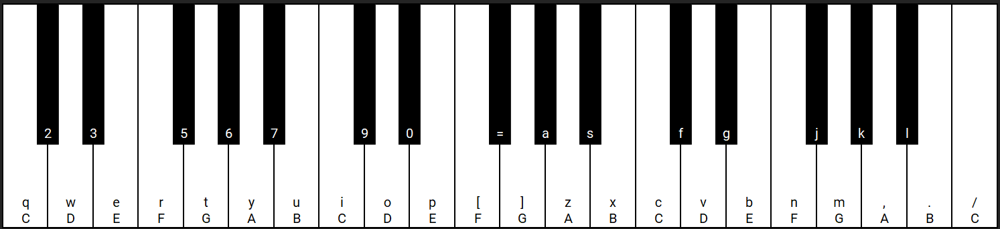
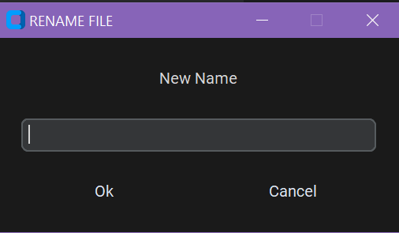
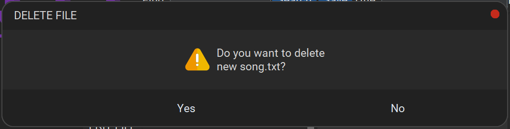

<p align="center">
    
</p>

## Description

MemoSong was designed for artists who like to create songs.
This application allows you to compose music and write lyrics in only one place.
The melody can be hummed using the Voice Recorder or played directly on the Piano.
It is possible to use keyboard for that. 
The included File Browsers make it easy to review the created music pieces.



## Requirements
- Install Python and all packages from `requirements.txt` file.

## Limitations
- To play more than two notes at the same time smoothly, you should use an anti-ghosting keyboard.
  - The typical keyboards may not collect some keystroke configurations at once.

## Instructions

### 1. Starting the Application

To start the application, run the memo_song.py.

### 2. Playing the Piano

There are two options to press piano buttons:

1. Directly clicking on the Piano key.

2. Playing using keyboard:<br>
   2.1 Enable keyboard.<br>
   Click the button with `green keyboard` or press ``` ` ```.<br>
   2.2 Press some key associated to the Piano keys.
   

*Note: To disable the keyboard, click the icon with `green keyboard` or ``` ` ```.*

### 3. Piano Recording

1. Starting recording<br>
To start the Piano Recorder, press the button with `red circle`.

2. Pausing recording<br>
To pause the Piano Recorder, press the button with `yellow rectangles`.

3. Stopping recording<br>
To stop the Piano Recorder, press the button with `blue square`.

### 4. Voice Recording

1. Starting recording<br>
To start the Voice Recorder, press the `microphone with red circle`.

2. Pausing recording<br>
To pause the Voice Recorder, press the `microphone with yellow rectangles`.

3. Stopping recording<br>
To stop the Voice Recorder, press the `microphone with blue square`.

### 5. Using Notepad

The Notepad feature allows you to save the song lyrics or some important notes.

1. Clearing notepad<br>
To remove all text from notepad, click `Clear Notepad` button.

### 6. Browsing Files

1. File filtering<br>
To easily find some specific recording/note, fill in the corresponding `Find` field 
and click the `Search` button next to it.

2. Updating list<br>
To refresh recordings/notes list, click the corresponding `Update List` button.

3. Muting playback<br>
By default, the recording is automatically played after clicking on it.
Press the button with `red crossed out speaker` to stop this playback.

### 7. Editing Files

1. Renaming the file<br>
To rename a file, select it and click the `Rename` button.
Provide a new name in the `RENAME FILE` window and click `Ok`.

    

2. Removing the file<br>
To delete a file, select it and click the `Delete` button. Click `Yes` in the `DELETE FILE` window.

    

### 8. Creating Custom File Names

The default recording names are `piano_recording_<timestamp>` and `voice_recording_<timestamp>`.
The default note name is `note_<timestamp>`.
To save the file with custom title, fill the corresponding `Title` field.

*Note: Fill the `Title` field before pressing `record` button.*
