

    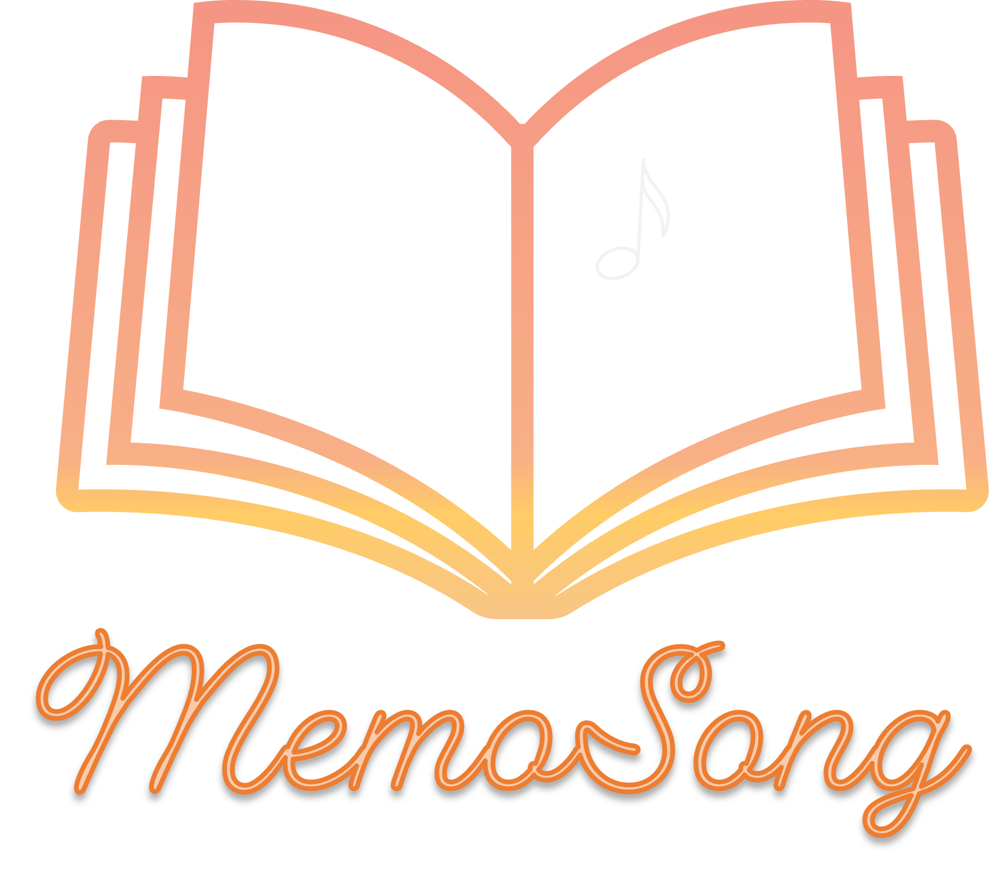

## DESCRIPTION:

MemoSong was designed for artists who like to create songs.
This application allows you to compose music and write lyrics in only one place.
The melody can be hummed using the voice recorder or played directly on the piano.
It is possible to use keyboard for that. 
The included file browsers make it easy to review the created music pieces.

## REQUIREMENTS:
To open application, you need to install requirements from requirements.txt file.
Run memo_song.py script.
(try to pack it into app)

## INSTRUCTIONS WITH SCREENSHOTS:
main layout
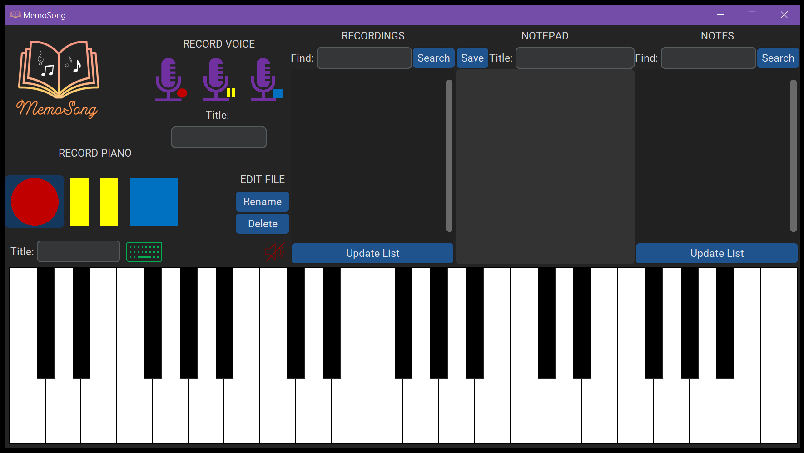

### PIANO FEATURE
turn on keyboard (also with `)
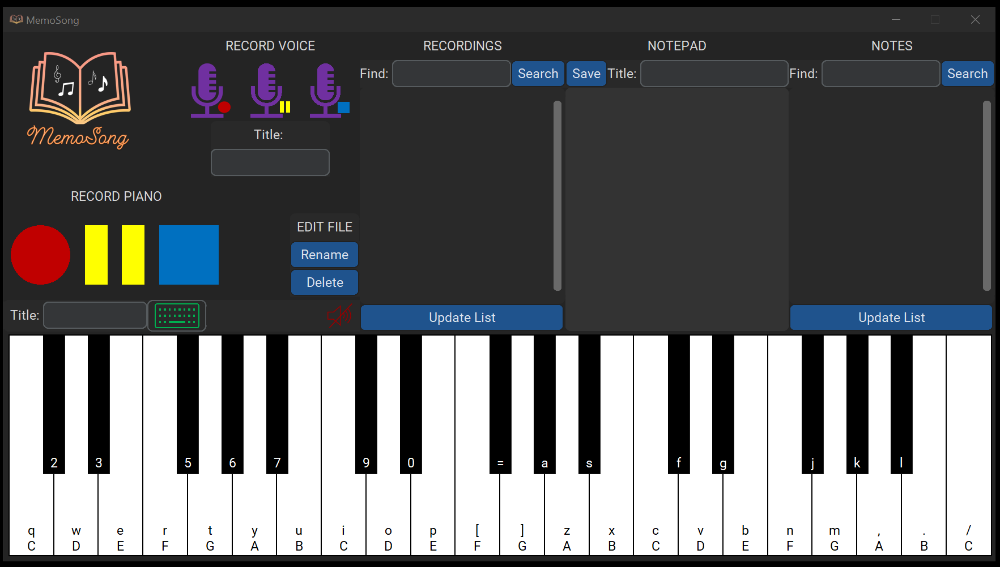

### PIANO RECORDER FEATURE
##### START RECORDING
piano recording
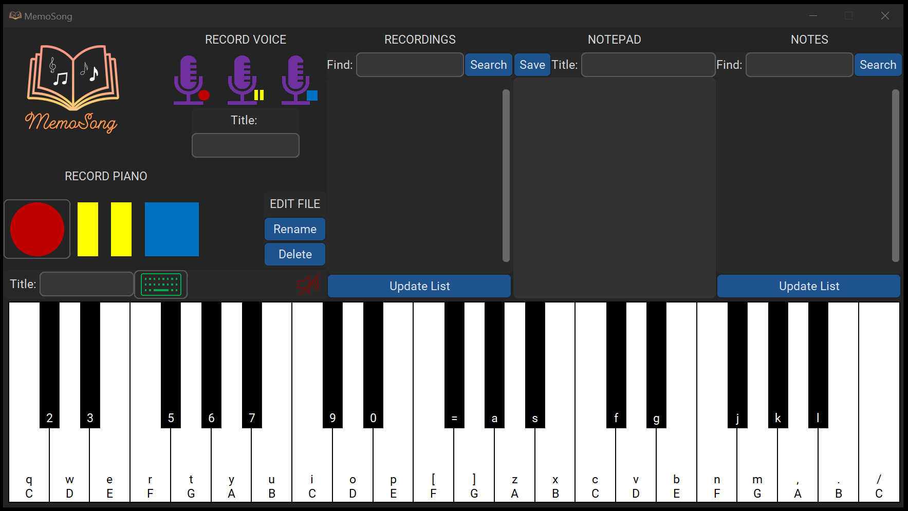

##### PAUSE RECORDING
pause recording
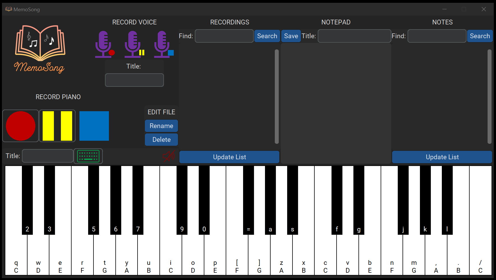

##### STOP RECORDING
stop recording - it appears on list
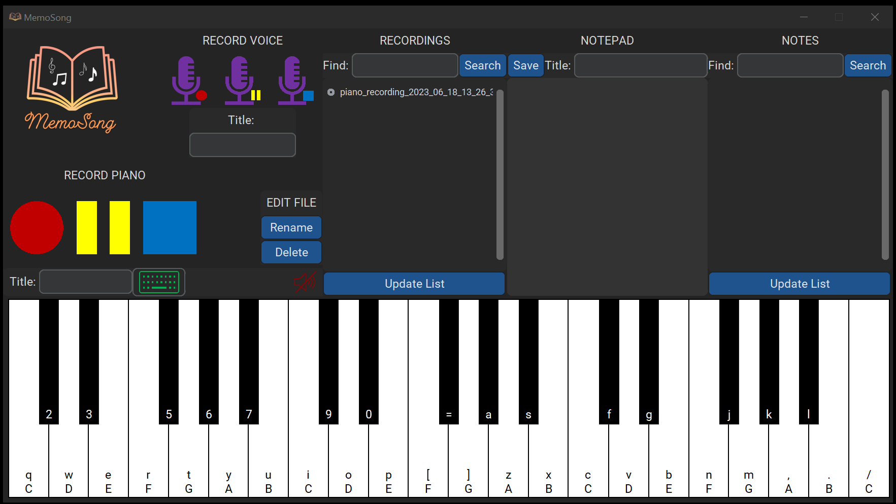

### VOICE RECORDER FEATURE
microphone record
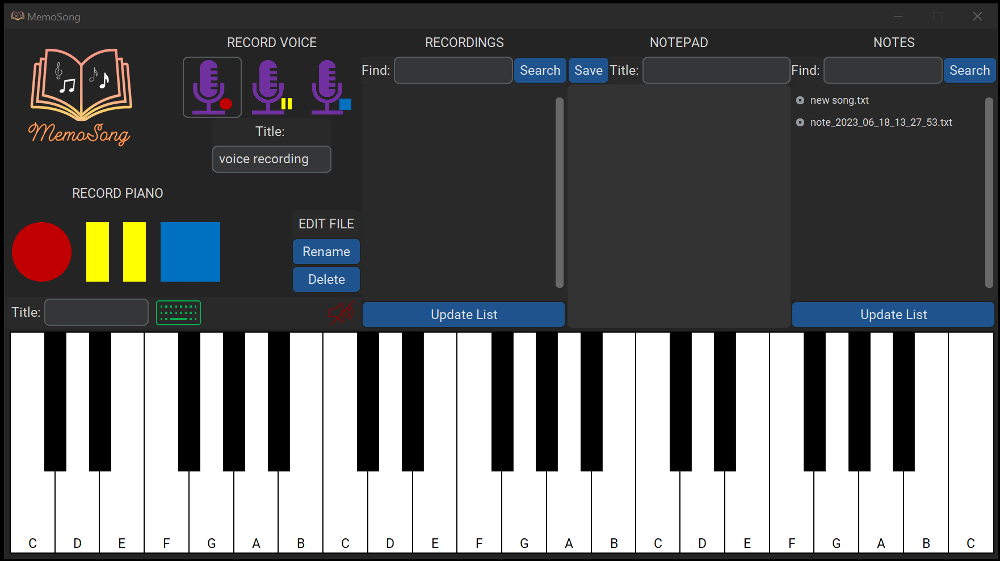

##### START RECORDING
set your own name
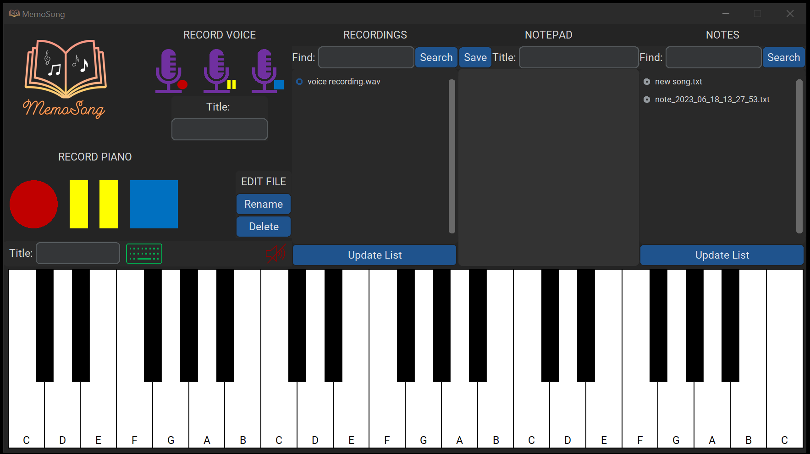

##### PAUSE RECORDING

##### STOP RECORDING

### NOTEPAD FEATURE
add note
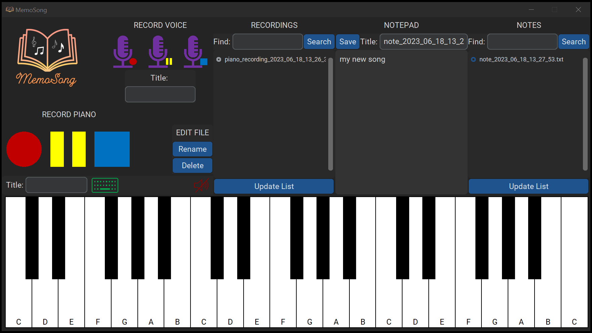

add note with custom title
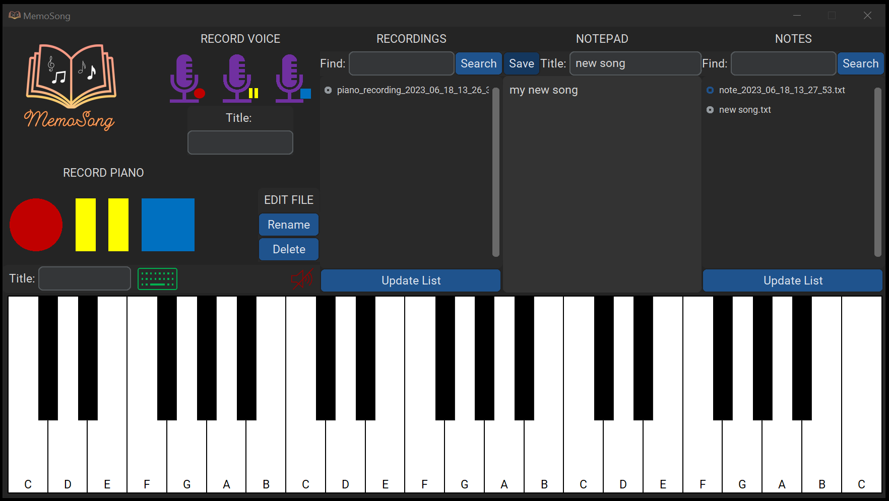

### FILE BROWSERS FEATURE
You can rename or delete any recording/note using appropriate button in the EDIT FILE frame.
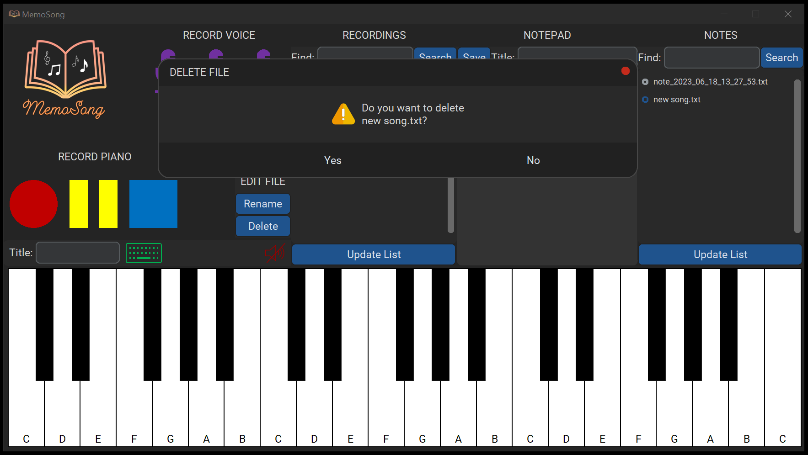

stop playback with red speaker
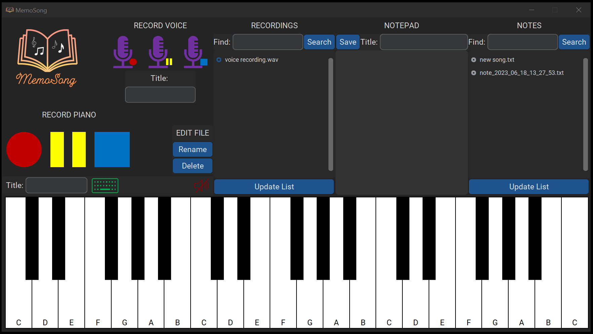

clear notepad

#### EDITING FILE

## LIMITATIONS:
1. To play more than two notes at the same time smoothly, you should use an anti-ghosting keyboard. Typical keyboards may not collect some keystroke configurations at once.
